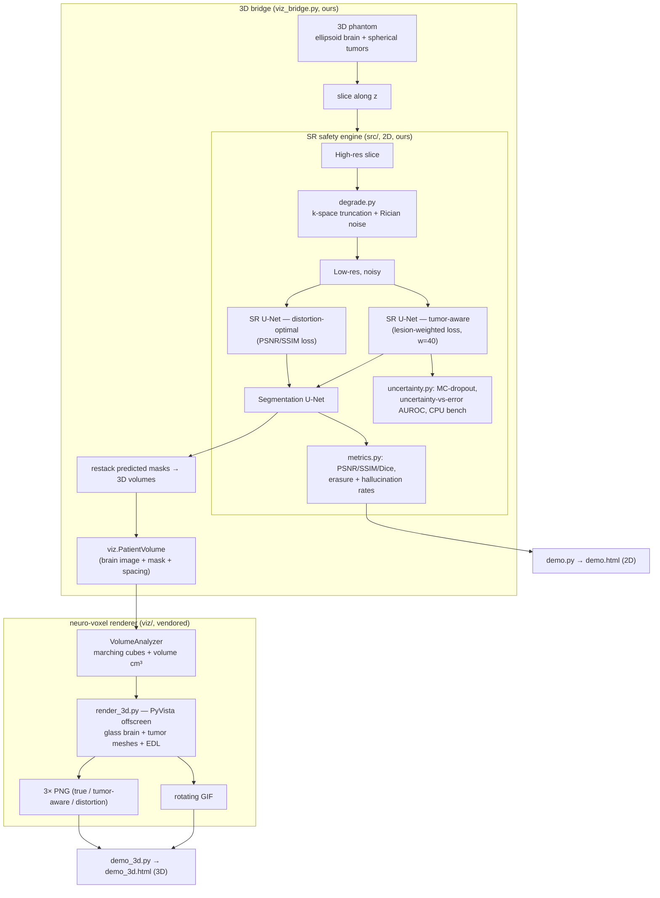

# Team Guide — Tumor-Aware MRI Super-Resolution (+ neuro-voxel 3D)

ACVSS hackathon. This is the one-page-ish brain dump so anyone on the team can
run the project, pitch it, and know what's real vs. illustrative.

---

## 1. The pitch (say this to judges)

> Cheap low-field MRI is blurry. Deep-learning **super-resolution (SR)** sharpens
> it — but SR is trained on image-quality metrics (PSNR/SSIM) that **barely
> penalize erasing a small tumor**. So a "better looking" scan can be a *less
> safe* scan. We show that failure, measure it, and fix it with a **tumor-aware**
> objective — then render the difference in **3D**.

**Headline result (current synthetic run):** at similar image quality,

| Version | Tumor volume recovered | Verdict |
|---|---|---|
| Ground truth | **2.80 cm³** | the tumor that's really there |
| Tumor-aware SR | **0.48 cm³** (~17%) | lesion partly preserved |
| Distortion-optimal SR | **0.00 cm³** (0%) | **lesion erased** |

⚠️ These exact cm³ come from a *synthetic phantom + quick-trained checkpoint* —
they demonstrate the **mechanism**, not a validated clinical number. The
**scientific** claim (lower False-Negative Erasure Rate at matched PSNR/SSIM,
esp. on small lesions) is the BraTS metrics table — see §7.

---

## 2. What we built — two subsystems

1. **SR safety engine** (`src/`) — the real ML. Degrade a scan → super-resolve
   two ways (distortion-optimal vs tumor-aware) → segment → measure image
   quality, Dice, **safety rates** (erasure / hallucination), **MC-dropout
   uncertainty**, and a **CPU benchmark**. 100% ours.
2. **3D visualization** (`viz/` + `*_3d.py`) — we integrated **neuro-voxel**
   (github.com/asmarufoglu/neuro-voxel) as the 3D renderer so the demo can show
   *our model's own output* as a rotating glass-brain + tumor mesh with a volume
   readout in cm³.

> We vendored **only neuro-voxel's `VolumeAnalyzer`** (marching-cubes mesh +
> cm³ volume). We do **not** use its 3D U-Net — upstream that model is a mock
> (`time.sleep(2)` then returns the ground-truth mask). Our real 2D SR/seg models
> drive everything.

---

## 3. Architecture



**Model shapes**
- **SR U-Net** (`sr_unet`): 2D, 4-level (32→64→128→256), residual, Dropout2d
  0.2 (kept on at inference for MC uncertainty). 1-ch in → 1-ch out.
- **Seg U-Net** (`seg_unet`): same backbone, no residual, no dropout, 1-ch
  logits out.
- **Forward degradation**: k-space truncation `factor=4` + Rician noise
  `sigma=0.03`, images normalized to [0,1], size 96 (from `checkpoints/demo.pt`
  meta).

---

## 4. Running the demos

Three ways to show it; all run on **CPU, no download**.

```bash
# one-time deps
pip install "numpy<2" torch scikit-image nibabel matplotlib pyvista imageio-ffmpeg

# 2D safety demo → demo.html (before/after panels, uncertainty, safety table)
python demo.py

# 3D demo → demo_3d.html (glass brain + tumor meshes + rotating GIF + cm³ readout)
python demo_3d.py

# interactive 2D app (optional): needs `pip install gradio`
python demo.py --gradio
```

If `checkpoints/demo.pt` is missing, `demo.py` quick-trains one on synthetic
data automatically (so it always runs). To (re)train explicitly:

```bash
python scripts/train_demo.py                      # synthetic, quick
python scripts/train_demo.py --brats --root PATH  # real BraTS
```

**Correctness check (CI-style):** `python smoke_test.py` runs the whole
pipeline end-to-end on synthetic data and prints the metric table.

**Quality-safety curve:** `python scripts/quality_safety_curve.py` writes
`quality_safety_curve.png`. It sweeps degradation severity and plots tumor
erasure rate against image quality (PSNR) for both models. The tumor-aware curve
stays below the distortion curve, which means fewer erased lesions at the same
image quality.

**Weights on Hugging Face:** the notebook has a final section that prompts for a
Hugging Face token (write access) and uploads the trained checkpoint to
`<username>/tumor-aware-sr-weights`. The teammate running the notebook pastes
their own token; nothing is stored in the repo.

---

## 5. Repo map

```
src/               SR safety engine (ours)
  degrade.py       k-space truncation + Rician noise forward model
  data.py          BraTS (.nii.gz) + synthetic 2D-slice datasets
  models.py        SR U-Net (dropout) + segmentation U-Net
  losses.py        distortion-optimal vs tumor-aware (lesion-weighted) losses
  metrics.py       PSNR, SSIM, Dice, erasure + hallucination rates
  uncertainty.py   MC-dropout, uncertainty-vs-error AUROC, CPU benchmark
  train.py         training loops        checkpoint.py  save/load models
  evaluate.py      end-to-end comparison + summary table
  figures.py       matplotlib comparison + uncertainty panels

viz/               3D visualization (neuro-voxel, vendored + bug-fixed)
  structure.py     PatientVolume dataclass  (fixed __repr__ indentation bug)
  analyzer.py      VolumeAnalyzer: cm³ volume + marching-cubes meshes

viz_bridge.py      3D phantom → real models per slice → PatientVolume + cm³
render_3d.py       PyVista offscreen → brain3d_*.png + brain3d_rotate.gif
demo_3d.py         bridge + render → self-contained demo_3d.html
demo.py            2D static/gradio demo → demo.html
smoke_test.py      end-to-end synthetic correctness check
scripts/           train_demo.py, make_notebook.py
notebooks/         tumor_aware_sr.ipynb  (Kaggle: real BraTS or synthetic)
checkpoints/demo.pt   trained demo weights (git-ignored, large)
```

---

## 6. Setup notes / gotchas

- **Python 3.12**, conda env (`~/miniconda3`). Torch 2.2, NumPy 1.26 (keep
  `numpy<2`), scikit-image, nibabel, matplotlib, imageio present.
- **PyVista + VTK** were installed for the 3D renderer. If a teammate hits
  `ModuleNotFoundError: pyvista`, run the pip line in §4.
- **Offscreen rendering works on macOS** as-is (`pv.OFF_SCREEN=True`). On a
  headless Linux box you may need `pv.start_xvfb()` or a virtual display.
- **PyVista subplots render blank offscreen** — that's why `render_3d.py` uses
  three separate single-view screenshots instead of one 1×3 subplot. Don't
  "simplify" it back to subplots.
- Large binaries (`*.pt`, `*.zip`, `demo.html`) are git-ignored. `*.png` too, so
  the 3D PNGs aren't committed — they're embedded (base64) into `demo_3d.html`.

---

## 7. Data & the real result

- **Default = synthetic** (procedural brain slices / 3D phantom). Everything runs
  with no download — good for the booth and for the 3D mechanism demo.
- **Real = BraTS** on Kaggle: open `notebooks/tumor_aware_sr.ipynb`, set
  `DATA_KIND="brats"`, point `DATA_ROOT` at a BraTS training folder (e.g. the
  BraTS2020 subset, no registration), enable GPU, Run All.
- **The scientific headline** to validate on BraTS: *at matched PSNR/SSIM, does
  tumor-aware SR have a lower **False-Negative Erasure Rate** than
  distortion-optimal SR, especially on small lesions?* Plus: does high MC-dropout
  **uncertainty coincide with error** (a complementary safety signal)?

---

## 8. Judge talking points

1. **The misalignment**: PSNR/SSIM reward average pixel fidelity; a 3 mm tumor is
   a rounding error to them. So "sharper" can mean "safely-looking but blind."
2. **The 3D moment**: same brain, same segmenter — flip the SR objective and the
   tumor *reappears*. cm³ readout makes erasure quantitative, not vibes.
3. **Uncertainty as a safety net**: MC-dropout flags where the model is unsure;
   we check whether that lines up with actual errors (AUROC).
4. **Deployable**: small U-Nets, CPU-benchmarked — realistic for low-resource /
   low-field settings (the BraTS-Africa motivation).

**Be honest if asked:** the 3D numbers are a synthetic-phantom proof of concept;
the acquisition is *simulated* (resolution loss + Rician noise, not true
field-strength contrast). Validation on real low-field / BraTS-Africa data is the
stated next step.

---

## 8b. FAQ (the questions we'll actually get)

**"What GAN do you use?"** — **None.** No GAN, no discriminator, no adversarial
loss. Two plain **U-Nets** (super-resolution + segmentation) trained with
pixel/lesion losses (`src/losses.py`). A GAN would arguably make the *safety*
problem **worse**: adversarial SR hallucinates realistic-looking detail, which is
exactly the failure we're warning about. Not using one is a deliberate choice.

**"What is Dice?"** — The Dice coefficient measures overlap between the predicted
tumor mask and the true mask: `Dice = 2·|P∩G| / (|P|+|G|)`, from 0 (no overlap)
to 1 (perfect). It's our segmentation-quality metric — but note a model can keep
a decent average Dice while still **erasing small lesions**, which is why we also
report the erasure rate, not just Dice.

**"You haven't trained anything — how does the demo work?"** — There's a
pre-trained checkpoint, **`checkpoints/demo.pt`**, quick-trained earlier on
**synthetic** data (a few epochs). Every demo loads it via
`src.checkpoint.load_models`. If it's ever missing, `demo.py` auto quick-trains
one on the fly. So the models *are* trained — just on synthetic slices, quickly,
as a proof of concept. **No real BraTS training has happened yet** — that's the
Kaggle run in §7, and it's what turns the illustrative numbers into a result.

**"What is 'true HR'?"** — True HR is the true high-resolution scan. It is the
original sharp image and the reference (the answer key). We degrade it to imitate
a cheap low-field scanner, run super-resolution on that degraded input, and then
compare each model's recovery against this true HR. In the 3D demo the "ground
truth" panel is the true HR tumor.

**"Is the 3D real patient data?"** — No. It's a synthetic 3D phantom (ellipsoid
brain + spherical tumors) styled to match the training distribution, so the
trained models behave meaningfully. The mechanism is real; the anatomy is a
stand-in until the BraTS run.

## 9. Git / current state

- Own repo initialized **inside this folder** (the home dir is a separate,
  unrelated git repo — we intentionally did **not** touch it).
- Branch **`neuro-voxel-integration`** off `main`. `main` = baseline SR project.
- The 3D integration (`viz/`, `viz_bridge.py`, `render_3d.py`, `demo_3d.py`,
  `demo_3d.html`, GIF) is currently **uncommitted** on the branch — review, then
  commit when the team's happy. Nothing is pushed to a remote yet.

---

## 10. Next steps / open TODO

- [ ] Run the **real BraTS** notebook and fill in the actual FNER / Dice / PSNR
      table (replaces the synthetic numbers in §1).
- [ ] Regenerate the 3D demo from a **BraTS-trained checkpoint** (swap the
      phantom in `viz_bridge.py` for a real case stacked from `BraTSSliceDataset`).
- [ ] Slides / poster (see the `slide-making` workflow if useful).
- [ ] Decide who owns: (a) BraTS run, (b) 3D/demo polish, (c) pitch + slides.
- [ ] Optional: upstream the neuro-voxel bug fixes (`.nii.gz` seg glob,
      `__repr__` indent, mock inference) as a courtesy PR.
